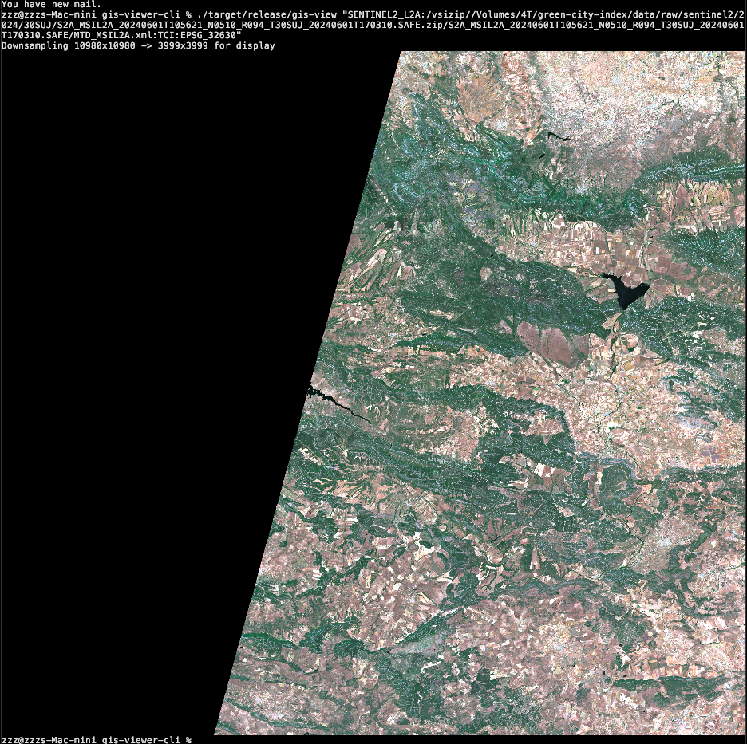
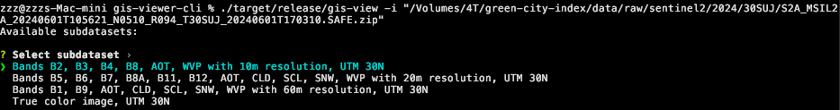
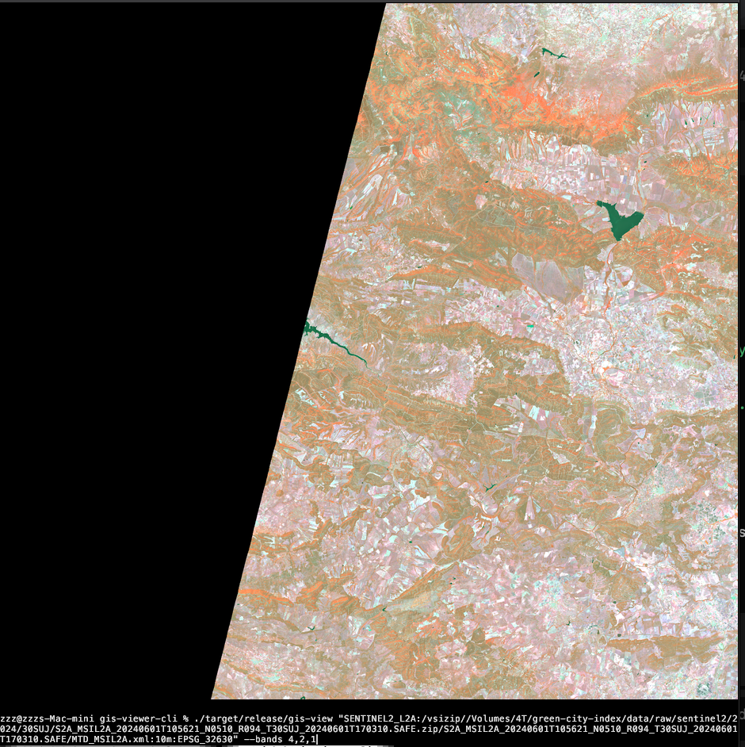

# gis-viewer-cli

View GIS raster images directly in the terminal. Supports Sentinel-2, GeoTIFF, COG, and any GDAL-supported format.


*Sentinel-2 True Color Image displayed in Kitty terminal*

## Features

- **Interactive mode** - auto-detects file structure, guides through subdataset and band selection
- **Full pixel rendering** in Kitty terminal (falls back to Unicode blocks elsewhere)
- **Read directly from zipped files** (Sentinel-2 SAFE.zip, etc.)
- **Band selection** for custom RGB composites
- **Automatic downsampling** for large rasters
- **Percentile stretch** for contrast enhancement
- **GIS metadata display**

## Installation

### macOS / Windows

Download the latest binary for your platform from [Releases](https://github.com/ominiverdi/gis-viewer-cli/releases).

GDAL must be installed:
```bash
# macOS
brew install gdal

# Windows: GDAL is bundled or use OSGeo4W
```

### Linux

**Important:** Linux binaries are dynamically linked to GDAL. You must download 
the binary matching your system's GDAL version, or build from source.

1. Check your GDAL version:
   ```bash
   gdal-config --version
   ```

2. Download the matching binary from [Releases](https://github.com/ominiverdi/gis-viewer-cli/releases):
   - Ubuntu 22.04 (GDAL 3.4): `gis-view-...-ubuntu22.04-gdal3.4.tar.gz`
   - Ubuntu 24.04 (GDAL 3.8): `gis-view-...-ubuntu24.04-gdal3.8.tar.gz`

3. Or **build from source** (recommended for non-standard GDAL versions):
   ```bash
   sudo apt install libgdal-dev
   cargo install --git https://github.com/ominiverdi/gis-viewer-cli
   ```

### Build from Source

```bash
# Install GDAL first
# macOS: brew install gdal
# Ubuntu: sudo apt install libgdal-dev

git clone https://github.com/ominiverdi/gis-viewer-cli.git
cd gis-viewer-cli
cargo build --release
```

Binary will be at `target/release/gis-view`.

See [Installation Guide](docs/installation.md) for detailed instructions and troubleshooting.

## Usage

```bash
# View a GeoTIFF
gis-view satellite.tif

# Show metadata only
gis-view satellite.tif --info

# Custom band selection (NIR-Red-Green false color)
gis-view image.tif --bands 4,3,2

# Adjust contrast stretch (default: 2%)
gis-view image.tif --stretch 5

# Control output resolution
gis-view large-image.tif --max-res 2000
```

### Interactive Mode

Use `-i` for guided exploration of any raster file:

```bash
gis-view -i image.tif
gis-view -i /path/to/S2A_MSIL2A_*.SAFE.zip
gis-view -i modis_data.hdf
```



The tool auto-detects the file structure:
- **Simple rasters** (GeoTIFF, PNG, etc.) → band selection menu
- **Multi-dataset formats** (Sentinel-2, HDF4/5, NetCDF, GRIB) → subdataset selection, then band selection

Supported formats with subdatasets:
- Sentinel-2 SAFE (`.zip` or extracted)
- HDF4/HDF5 (MODIS, VIIRS, Landsat)
- NetCDF
- GRIB/GRIB2
- Multi-resolution COGs

After selection, it shows the equivalent command for scripting.

### Sentinel-2 from ZIP (Direct)

```bash
# True Color Image
gis-view "SENTINEL2_L2A:/vsizip//path/to/S2A_MSIL2A_*.SAFE.zip/*/MTD_MSIL2A.xml:TCI:EPSG_32630"

# 10m bands with false color composite
gis-view "SENTINEL2_L2A:/vsizip//path/to/S2A_MSIL2A_*.SAFE.zip/*/MTD_MSIL2A.xml:10m:EPSG_32630" --bands 4,3,2
```

### Band Combinations

| Name | Bands | Description |
|------|-------|-------------|
| True color | `3,2,1` | Natural looking |
| False color | `4,3,2` | Vegetation appears red |
| NIR | `4,4,4` | Single band grayscale |


*False color composite (bands 4,2,1) - vegetation appears pink/salmon*

## Terminal Support

| Terminal | Quality |
|----------|---------|
| Kitty | Full pixels (best) |
| iTerm2 | Full pixels |
| WezTerm | Full pixels |
| Others | Unicode half-blocks |

For best results, use [Kitty](https://sw.kovidgoyal.net/kitty/).

## License

MIT
